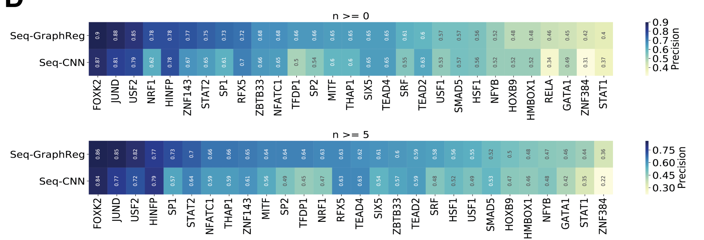

# Fig 4 Seq-GraphReg predicts the direct targets of transcription factor perturbation via motif ablation

## Methods and concepts to clarify
- In sillico TF motif ablation: Zero out all TF binding motifs within 6MB region of the candidate target genes
- DEG analysis with DESeq2
- **True Mean Log2FC**
Calculated based on the real KO experiment and true control groups.
- **Predicted target genes**
  Selected based on the predicted log2FC
- Precision: Fraction of true significantly downregulated genes (significant DEG in terms of comparison between real experiments) among 100 predicted genes.

  
## 4A. Predicted target genes of seq-graphreg are more downregulated than baseline or seq-CNN

- Eachpoint is one dataset (TF KO experiment), 29 datasets intotal.
- baseline is randomly selecting 100 genes from significant DEGs from DEseq2 results between **real** KO experiment and control
- n is the number of 3D interactions. 
When $n \geq 5$  the performance difference between seq-graphreg and seq-CNN would be more significant.
(The additional information brought by 3D interaction could be the main reason that seq-graphreg outperforms seq-CNN)

## 4B 
4A show results in distribution level, while 4B show the comprison between models for each TF.

## 4C

- baseline precision is around 0.5, because there are also upregulated genes?
- Do not visually compare 2 panels in 4C, the scales are different. Actually $n \geq 0$ has better precision. (More obvious in 4D)

## 4D

## 4E

- A and B are 2 direct enhancers according to HiChIP graph

- Color in ISM heatmap: Difference of prediction between mutated and reference. So there would be only 3 non-zero values in one column. Blue-ish color means the mutation in this position would cause down regulation of TCF3
- ISM score: the height of the weblogo, negative of sum of 3 non-zero differences. (The bluer overall on a bp, the higher the letter is)